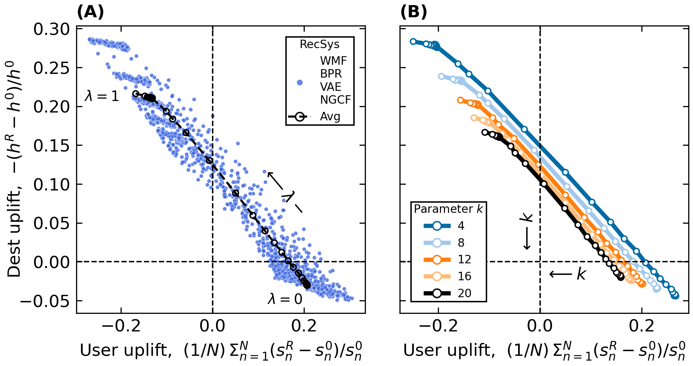

### Positive-Sum Impact of Multistakeholder Recommender Systems for Urban Tourism Promotion and User Utility

This repository contains source code for replicating experiments for the 
RecSys 2024 conference. It also includes training logs, noting that
hyperparameter tuning and simulations are time-consuming and require 24GB of RAM.

##### In case you plan to replicate experiments

Download this repository and original datasets:
- <https://github.com/igobrilhante/TripBuilder> (full)
- <https://sites.google.com/site/yangdingqi/home/foursquare-dataset> (global-scale check-in dataset)

Prepare `recsys` directory structure and unpack data:
```
(recsys)
|-- data
|   |-- Foursquare33M
|   |   |-- dataset_TIST2015_Checkins.txt
|   |   |-- dataset_TIST2015_Cities.txt
|   |   |-- dataset_TIST2015_POIs.txt
|   |   `-- dataset_TIST2015_readme.txt
|   `-- tripbuilder-dataset-dist
|       |-- assets
|       |   |-- ...
|       |   `-- license.txt
|       |-- florence
|       |   |-- florence-photos.txt
|       |   |-- florence-pois-clusters.txt
|       |   |-- florence-pois.txt
|       |   |-- florence-trajectories.txt
|       |   `-- license.txt
|       |-- index.html
|       |-- license.txt
|       |-- pisa
|       |   |-- license.txt
|       |   |-- pisa-photos.txt
|       |   |-- pisa-pois-clusters.txt
|       |   |-- pisa-pois.txt
|       |   `-- pisa-trajectories.txt
|       `-- rome
|           |-- license.txt
|           |-- rome-photos.txt
|           |-- rome-pois-clusters.txt
|           |-- rome-pois.txt
|           `-- rome-trajectories.txt
|-- log
|-- out
|-- run1_F.sh
|-- run1_I.sh
|-- run1_R.sh
|-- run2_F.sh
|-- run2_I.sh
|-- run2_R.sh
`-- src
    `-- exp
        |-- __init__.py
        |-- collaborative_filtering.py
        |-- datafactory.py
        |-- environment.py
        |-- proc_Flickr.py
        |-- proc_Foursquare.py
        |-- recommender.py
        |-- run1.py
        |-- run2.py
        |-- runx.py
        |-- runx_batch.py
        |-- sim.py
        |-- ubm.py
        `-- utils.py
```

0. Run from `recsys` directory:
```
python3 src/exp/proc_Flickr.py
python3 src/exp/proc_Foursquare.py
```
It will process source data, separate local residents from tourists, 
and apply Core-filtering.


1. Run:
```
./run1_R.sh
./run1_F.sh
./run1_I.sh
```
In a sequence, or parallel from different terminal screens.
It will process Rome (R), Florence (F), and Istanbul (I) true user preferences 
and save results (`out/` dir) and corresponding training logs (`log/` dir) to disk. 

2. Run:
```
./run2_R.sh
./run2_F.sh
./run2_I.sh
```
In a sequence, or parallel from different terminal screens.
It will estimate limited awareness set for each user and calibrate 
multinomial choice model, and save results (`out/` dir) and corresponding 
training logs (`log/` dir) to disk.

3. Run:
```
python3 src/exp/runx_batch.py --city Rome
python3 src/exp/runx_batch.py --city Florence
python3 src/exp/runx_batch.py --city Istanbul
```
(sequentially!) because each run is already executed in 
parallel and consumes 24GB of RAM memory. This step will produce both: 
experiment artefacts (`.pk` files in `out/experiments/`) 
and experiment logs (`log/` dir).

4. Run in order to reproduce our Figure:
```
plot.ipynb
```



requirements.txt:
```
cornac==2.1.0
h5py==3.10.0
numba==0.59.1
numpy==1.26.4
polars==0.20.18
```
